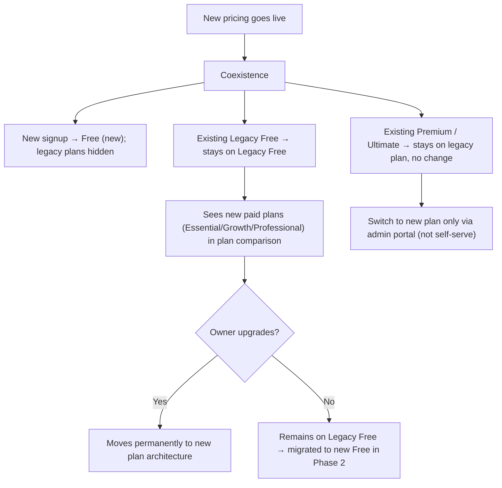
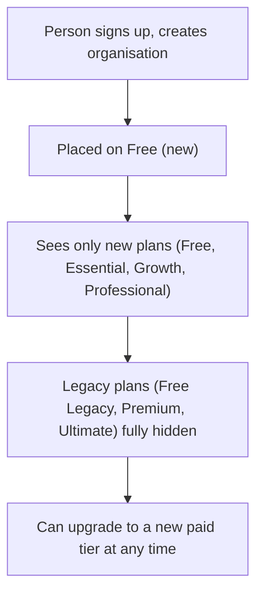

# New Pricing Plan

## 1. Problem Statement

### 1.1 What is the problem?

Jibble's legacy 3-tier model (Free, Premium, Ultimate) does not capture value evenly across the SME spectrum — there is a large price jump from Free to Premium, and no tier for small-medium teams who need a little more than Free but not the full Premium feature set. The new 4-tier model (Free, Essential, Growth, Professional) introduces an entry-level paid tier and re-segments features so each tier maps to a clearer organisation size and need.

### 1.2 Who has this problem?

Prospective customers evaluating Jibble (the Free → paid jump is too steep), existing organisations on legacy plans whose needs sit between tiers, and internal Sales/Support/Product teams who must position and maintain pricing. Affected roles inside an organisation are primarily the **Owner** and **Admin** (who manage subscriptions); **Managers** and **Members** experience the result as feature availability.

### 1.3 How do we know this is real?

This is a planned 2026 strategic initiative. The new pricing architecture re-segments the existing feature set to better match willingness-to-pay across SME sizes (1–20, 20–50, 50–1,000 persons). Source of truth: the *New Subscription Plans & Feature Limits* reference and the *Jibble Pricing Packages 2026* spreadsheet (New sheet), last crosschecked 02-04-2026.

### 1.4 What happens if we do nothing?

Jibble continues to lose small-medium prospects who churn at the Free → Premium boundary, and leaves revenue on the table from organisations who would pay for an intermediate tier. The competitive gap against per-seat-tiered competitors (Clockify, Hubstaff, When I Work, Deputy) widens.

### 1.5 What is the current alternative?

The legacy 3-tier model. It remains valid for existing legacy-plan organisations but offers no entry-level paid step and a coarser feature split.

### 1.6 Competitive landscape

Competitors generally run 3–4 paid tiers with a low-cost entry plan (e.g. Clockify Basic/Standard/Pro/Enterprise, Hubstaff Starter/Grow/Team/Enterprise). The new 4-tier model brings Jibble in line with this pattern by adding an entry-level Essential tier below the existing Premium/Ultimate equivalents.

---

## 2. Goals, Non-Goals & Success Metrics

### 2.1 Goals

- Ship a 4-tier plan set (Free, Essential, Growth, Professional) with a clear feature matrix that is the single source of truth for feature gating.
- Let new and existing organisations coexist on new and legacy plans with **zero disruption** to existing paid organisations — no involuntary plan changes, no feature loss.
- Give legacy Free organisations a clear, self-serve upgrade path into the new paid tiers.

### 2.2 Non-goals

- Forcing existing paid (Premium, Ultimate) organisations onto new plans — they remain on legacy plans indefinitely or until they voluntarily switch.
- Changing trial mechanics, invoice calculation, billing models, proration, or payment-failure flows — these remain as specified in the legacy *Trial, Billing flow & Invoice calculations* spec and are **out of scope** here.
- Enterprise tier rollout and full legacy-plan sunset — both are separate, future initiatives.

### 2.3 Success Metrics (GSM)

| Goal | Signal | Metric | Baseline | Target | Timeline |
|------|--------|--------|----------|--------|----------|
| Lower the Free → paid barrier | New paid signups land on the entry tier | % of new paid conversions choosing Essential | 0 (tier is new) | ≥ 25% of new paid conversions | 90 days post-launch |
| Re-segment value | Trial-to-paid conversion | New-plan trial → paid conversion rate | Legacy conversion rate (TBC) | ≥ legacy rate, no regression | 90 days post-launch |
| Coexistence without disruption | Existing paid orgs unaffected | Involuntary plan changes / feature-loss tickets from legacy paid orgs | 0 | 0 | Launch + ongoing |
| Legacy Free upgrade path | Legacy Free orgs upgrade to new paid | % of legacy Free orgs upgrading to a new paid tier | 0 | TBC | 6 months post-launch |

<!-- PM: Confirm baselines for trial→paid conversion and set the legacy-Free upgrade target. -->

---

## 3. Solution Overview

Jibble introduces a new 4-tier plan set — **Free, Essential, Growth, Professional** — that re-packages the existing feature set into finer-grained tiers. The new tiers launch alongside the legacy tiers in a **coexistence** model: existing organisations keep their current plan, while all new signups see only the new plans.

A new organisation is created on the **Free (new)** plan and sees only the new tiers; legacy plans are hidden from it. Existing **paid** organisations (Premium, Ultimate) stay on their legacy plan with no change and cannot self-switch to new plans. Existing **legacy Free** organisations stay on legacy Free but see the new paid tiers (Essential, Growth, Professional) as upgrade options, giving them a self-serve path forward. A later phase migrates remaining legacy Free organisations to the new Free plan.



---

## 4. Plan Details

### 4.1 Pricing

Using: **new** plan set. Annual plans require full upfront payment. Currency is determined by the person's geographical location at signup; if the country is not in the supported currency list, the default is USD.

| Tier | Monthly (USD) | Annually (USD, per month) | Visibility |
|------|---------------|---------------------------|------------|
| Free | $0 | $0 | Public |
| Essential | $2.99 | $1.99 | Public |
| Growth | $5.99 | $4.49 | Public |
| Professional | $10.99 | $7.99 | Public |

<!-- PM: Other-currency price table is marked TBC in source. Link it here once finalised. -->

### 4.2 Target persona by tier

| Tier | Target organisation |
|------|---------------------|
| Free | Small companies needing basic time tracking, 1–20 persons |
| Essential | Small-medium companies needing some group customisation and more admin/manager roles, 20–50 persons |
| Growth | Medium-large companies needing group customisation, more desk-based persons, at-a-glance reports, 50–1,000 persons |
| Professional | Medium-large companies with more mobile/kiosk persons and fraud-prevention needs, 50–1,000 persons |

### 4.3 Plan terminology

| Term | Definition |
|------|------------|
| Feature set | A package defined by the features included in it |
| Plan | A name combining [Feature set][Period][Currency], e.g. `Growth Annual USD` |
| Period | Monthly or annual billing |
| Legacy plans | Free (Legacy), Premium, Ultimate — the existing 3-tier model |
| New plans | Free, Essential, Growth, Professional — the new 4-tier model |

### 4.4 Feature matrix (new plans)

Legend: ✅ included · ⛔ not available · numeric = count/limit.

**Time Tracking**

| Feature | Free | Essential | Growth | Professional |
|---------|------|-----------|--------|--------------|
| Mobile / Kiosk / Web / Desktop clock in | ✅ | ✅ | ✅ | ✅ |
| Slack / MS Teams clock in, Chrome extension | ✅ | ✅ | ✅ | ✅ |
| Hour entries, Manual entries, Offline mode, Add time for others | ✅ | ✅ | ✅ | ✅ |
| Auto clock out | ⛔ | ✅ | ✅ | ✅ |
| Desktop auto clock in/out | ⛔ | ✅ | ✅ | ✅ |
| Desktop sleep/lock detection | ⛔ | ⛔ | ✅ | ✅ |

**Location**

| Feature | Free | Essential | Growth | Professional |
|---------|------|-----------|--------|--------------|
| Geofences | 2 | 10 | Unlimited | Unlimited |
| GPS per entry, Geofence automation | ✅ | ✅ | ✅ | ✅ |
| Geofence on kiosk | ⛔ | ✅ | ✅ | ✅ |
| Live location | ⛔ | ⛔ | ⛔ | ✅ |

**Face Recognition & Identity**

| Feature | Free | Essential | Growth | Professional |
|---------|------|-----------|--------|--------------|
| Face recognition (kiosk V3, mobile V2), Selfie capture | ✅ | ✅ | ✅ | ✅ |
| Kiosk PIN, NFC, RFID, 2FA, SSO login | ✅ | ✅ | ✅ | ✅ |
| Face spoofing detection | ⛔ | ⛔ | ⛔ | ✅ |
| Device lock | ⛔ | ⛔ | ⛔ | ✅ |

**Notifications**

| Feature | Free | Essential | Growth | Professional |
|---------|------|-----------|--------|--------------|
| Time off notification, Personal daily/weekly email | ✅ | ✅ | ✅ | ✅ |
| Clock in/out & end-break reminders, Overtime, Member running late, Face data change, FR mismatch, Team email updates | ⛔ | ✅ | ✅ | ✅ |

> Team email updates skipped for Phase 1 (4 Feb 2026).

**Schedules**

| Feature | Free | Essential | Growth | Professional |
|---------|------|-----------|--------|--------------|
| Work schedules | 1 | 3 | Unlimited | Unlimited |
| Custom breaks, Overtime | ✅ | ✅ | ✅ | ✅ |
| Break allocation time, Location-specific schedule, Automated deductions | ⛔ | ✅ | ✅ | ✅ |

**Activities, Projects & Clients**

| Feature | Free | Essential | Growth | Professional |
|---------|------|-----------|--------|--------------|
| Activities, Projects, Clients | ✅ | ✅ | ✅ | ✅ |
| Require activity / Require project | ⛔ | ✅ | ✅ | ✅ |
| Default activity/project (mobile, kiosk, desktop) | ⛔ | ✅ | ✅ | ✅ |

**Payroll & Billing**

| Feature | Free | Essential | Growth | Professional |
|---------|------|-----------|--------|--------------|
| Member hourly rate, Project-Client link, Adjustable payroll hours, Export & change logs, Timesheet/tracked-time export | ✅ | ✅ | ✅ | ✅ |
| Pay period, Timesheet approval, Lock timesheets | ⛔ | ✅ | ✅ | ✅ |
| Attendance insights report | ⛔ | ⛔ | ✅ | ✅ |

**Leave Management**

| Feature | Free | Essential | Growth | Professional |
|---------|------|-----------|--------|--------------|
| Leave policies, Public holidays | ✅ | ✅ | ✅ | ✅ |
| Multiple leave calendars | ⛔ | ✅ | ✅ | ✅ |
| Leave workflow, accruals, carry forward, multi-level approval, leave report | ⛔ | ⛔ | ✅ | ✅ |
| Custom approver permissions | ⛔ | ⛔ | ⛔ | ✅ |

**Roles, Permissions & Groups**

| Feature | Free | Essential | Growth | Professional |
|---------|------|-----------|--------|--------------|
| Admins | 1 (+1 Owner) | 3 | Unlimited | Unlimited |
| Managers | ⛔ | 5 | Unlimited | Unlimited |
| Groups | ⛔ | 5 | Unlimited | Unlimited |
| Bulk edits | ✅ | ✅ | ✅ | ✅ |
| Group settings, Activity assignment, Assign by groups | ⛔ | ✅ | ✅ | ✅ |
| Rounding | ⛔ | ⛔ | ✅ | ✅ |
| API access (Zapier only — no custom API) | ⛔ | ⛔ | ✅ | ✅ |
| Custom permissions | ⛔ | ⛔ | ⛔ | ✅ |

**Kiosk**

| Feature | Free | Essential | Growth | Professional |
|---------|------|-----------|--------|--------------|
| Basic, Face recognition, NFC, QR (coming soon) | ✅ | ✅ | ✅ | ✅ |
| Onsite kiosks | 1 | 3 | 10 | Unlimited |
| Speed Face Recognition | ⛔ | ⛔ | ✅ | ✅ |

**Screenshots**

| Feature | Free | Essential | Growth | Professional |
|---------|------|-----------|--------|--------------|
| Screenshot capture, Custom resolutions | ✅ | ✅ | ✅ | ✅ |
| Storage | 3 days | 3 days | 1 month | Up to 12 months |
| Intervals | 10 mins | 10 mins | 5, 10 mins | 2, 5, 10 mins |

**Support & Integrations**

| Feature | Free | Essential | Growth | Professional |
|---------|------|-----------|--------|--------------|
| Multi-lingual app & Help articles | ✅ | ✅ | ✅ | ✅ |
| Livechat, Demo | ⛔ | ✅ | ✅ | ✅ |
| Xero, QuickBooks, Deel, Zapier, PayrollPanda | ✅ | ✅ | ✅ | ✅ |

> Integrations remain free across all tiers.

### 4.5 What changed vs legacy

Features re-tiered relative to the legacy plans (features not listed are unchanged in availability).

Moved from **Legacy Free** up to **Essential**: Auto clock out · Desktop auto clock in/out · Clock in/out reminders · End break reminders · Face data change notification · Overtime notification · Member running late notification · Break allocation time · Automated deductions · Default activity/project (all platforms) · Pay period · Timesheet approval · Lock timesheets · Multiple leave calendars · Geofence on kiosk · Team email updates.

Moved from **Legacy Free** up to **Growth**: Desktop sleep/lock detection · Speed Face Recognition (kiosk) · API access.

Moved from **Legacy Free** up to **Professional**: Device lock.

Re-tiered from **Premium**:

| Feature | Legacy (Premium) | New tier | Change |
|---------|------------------|----------|--------|
| Face spoofing detection | ✅ | Professional only | Moved up — ⛔ on Essential & Growth |
| Leave workflow / accruals / carry forward / multi-level approval / leave report | ✅ | Growth | Moved up — ⛔ on Essential |
| Screenshot storage | 1 month | Essential 3 days, Growth 1 month | Essential lower than legacy Premium |
| Screenshot intervals | 5, 10 mins | Essential 10 mins, Growth 5, 10 mins | Essential lower than legacy Premium |

New count caps:

| Feature | Legacy Free | Legacy Premium | New Free | New Essential | New Growth | New Professional |
|---------|-------------|----------------|----------|---------------|------------|------------------|
| Geofences | 2 | Unlimited | 2 | 10 | Unlimited | Unlimited |
| Work schedules | 1 | Unlimited | 1 | 3 | Unlimited | Unlimited |
| Admins | 1 | Unlimited | 1 | 3 | Unlimited | Unlimited |
| Managers | ⛔ | Unlimited | ⛔ | 5 | Unlimited | Unlimited |
| Groups | ⛔ | Unlimited | ⛔ | 5 | Unlimited | Unlimited |
| Onsite kiosks | 1 | Unlimited | 1 | 3 | 10 | Unlimited |

---

## 5. New Persons (New Signups)

### 5.1 Flow



**Preconditions:** New pricing is live; person is signing up for the first time.

**Postconditions:** Organisation is on Free (new). Only new plan tiers are ever shown to it.

### 5.2 Acceptance Criteria

```gherkin
Scenario: New signup lands on the new plan set
  Given new pricing is live
  When a person signs up and creates an organisation
  Then the organisation is placed on Free (new)
    And only the new plans (Free, Essential, Growth, Professional) are shown
    And legacy plans are not visible anywhere in the subscription UI

Scenario: New organisation upgrades to a paid tier
  Given an organisation is on Free (new)
  When the Owner selects a new paid tier and completes the upgrade
  Then all features for that tier become available immediately
    And the organisation operates entirely within the new plan architecture
```

> Trial behaviour for new signups (14-day, plan-switching during trial, expiry outcomes) is governed by the *Person Lifecycle* and legacy *Trial & Billing* specs and is out of scope here.

---

## 6. Existing Persons (Coexistence & Migration)

After launch, new and legacy plans run in parallel. Behaviour differs by the organisation's current plan.

### 6.1 Behaviour by current plan

| Current plan | What they see | Can self-switch to new plans? | Outcome |
|--------------|---------------|-------------------------------|---------|
| Premium (Active / InTrial / Cancelled) | Their existing Premium plan only | No | Stays on Premium indefinitely; full feature access unchanged; continues to receive feature updates |
| Ultimate (Active / InTrial / Cancelled) | Their existing Ultimate plan only | No | Stays on Ultimate indefinitely; full feature access unchanged |
| Legacy Free | New paid plans (Essential, Growth, Professional) as upgrade options; current plan shown as "Free" | Yes (upgrade only) | Stays on Legacy Free until they upgrade; migrated to new Free in Phase 2 |
| PPC Free | Unchanged | No | Not affected by migration |

Legacy Premium/Ultimate plans are **not** shown to legacy Free or new users. Once an organisation moves to a new plan it **cannot return** to a legacy plan.

### 6.2 Rollout phases

- **Phase 1 — Coexistence (launch):** Existing organisations keep their current plan. New signups get the new plans. Legacy Free organisations see new paid plans as upgrade options.
- **Phase 2 — Legacy Free migration:** Remaining Legacy Free organisations are migrated to the new Free plan in stages, with clear communication before any change takes effect. *(Status: future / TBC.)*

### 6.3 Admin-portal-assisted switching

Existing paid organisations cannot self-switch, but a Jibble admin portal operator can move them between plans on request. Mapped transitions:

| Direction | From → To |
|-----------|-----------|
| Upgrade | Premium → Growth or Professional; Ultimate → Professional |
| Downgrade | Premium → Essential; Ultimate → Growth or Essential |

Upgrades via admin portal take effect **immediately**; downgrades are **scheduled** unless overridden to apply immediately. Billing adjusts via Chargebee (mechanics out of scope here).

### 6.4 Acceptance Criteria

```gherkin
Scenario: Existing Premium organisation is unaffected at launch
  Given an organisation is on Premium (Active)
    And new pricing has launched
  When the Owner logs in
  Then they see their existing Premium plan on the subscription page
    And all Premium features remain available
    And they cannot self-switch to Essential, Growth, or Professional

Scenario: Legacy Free organisation sees and takes the upgrade path
  Given an organisation is on Legacy Free
  When the Owner opens the plan comparison page on web
  Then they see Essential, Growth, and Professional as upgrade options
    And legacy Premium and Ultimate are not shown
    And their current plan is displayed as "Free"
  When the Owner selects Essential and completes the upgrade
  Then the organisation moves to Essential (new)
    And Essential features become available immediately

Scenario: Legacy Free upgrades then downgrades
  Given a Legacy Free organisation upgraded to a new paid tier
  When they later downgrade
  Then they land on Free (new), not Legacy Free

Scenario: Admin portal switches an existing paid organisation
  Given an organisation is on Premium (Active)
  When an admin portal operator switches it to Growth
  Then the organisation's plan becomes Growth
    And feature availability matches the Growth tier
    And billing is adjusted via Chargebee
```

### 6.5 Edge cases

| Scenario | Expected behaviour | Status |
|----------|--------------------|--------|
| Legacy Premium org with `InTrial` status at launch | Stays on Legacy Premium trial; trial expiry follows existing flow | Finalized |
| Legacy Premium org with `Cancelled` status at launch | Stays on Legacy Premium (cancelled); re-activation re-activates Legacy Premium | Finalized |
| Multi-org Owner: one org on Premium, one on Legacy Free | Each org handled independently — Premium stays; Legacy Free sees new paid plans and is migrated in Phase 2 | Finalized |
| Legacy Free upgrades to Essential, then downgrades | Lands on Free (new), not Legacy Free | Finalized |
| Admin portal switches a Premium org mid-billing-cycle | Billing prorated via Chargebee; feature availability changes per target tier | Finalized |

---

## 7. Downgrade Behaviour (New Plans)

When an organisation moves to a more restrictive new tier, restrictions apply per the target tier. Restrictions fall into three categories: **feature disabled** (turned off, settings restricted), **count capped** (excess entities archived/deleted), and **property restricted** (specific configuration cleared).

**Core principle:** Previously tracked data — time entries, timesheets, leave records — is **never deleted** on downgrade; it may become read-only or hidden but is preserved. Settings and configurations may be reset and are generally **not restored** on re-upgrade (the person must reconfigure). Paid-to-paid downgrades take effect at the end of the billing cycle; downgrade to Free takes effect immediately.

### 7.1 Downgrade summary by boundary

| Boundary | Key impacts |
|----------|-------------|
| Professional → Growth | Live location, face spoofing detection, device lock disabled; custom permissions & custom approver permissions reverted to defaults; kiosks capped at 10 (excess deactivated); screenshot storage → 1 month, 2-min interval → 5 min |
| Growth → Essential | Desktop sleep/lock detection, Speed FR kiosk, API access (tokens deactivated), rounding disabled; leave workflow/accruals/carry forward/multi-level approval disabled and balances removed; attendance insights & leave report hidden; kiosks → 3, geofences → 10, work schedules → 3; screenshot storage → 3 days, interval → 10 min |
| Essential → Free | Auto clock out, desktop auto clock in/out, all paid notifications, break allocation, automated deductions, pay period, approval, lock timesheets, geofence on kiosk disabled; default activity/project cleared; require activity/project disabled; non-default work schedules & leave calendars deleted; admins → 1, managers reverted to Member, group management disabled; geofences → 2 (excess archived); kiosks → 1 |

### 7.2 Data preservation rules (selected)

| Area | On downgrade |
|------|--------------|
| Time entries & timesheets | Always preserved; not auto-recalculated except where automated deductions/overtime are hidden (Free) |
| Work schedules | Non-default deleted on Free; capped to 3 on Essential (default + 2 oldest kept); deleted schedules not restored on re-upgrade |
| Locations / geofences | Excess archived (not deleted); restorable from Archived Locations on re-upgrade; archived locations unlinked from projects |
| Roles | Excess admins/managers reverted to Member by order added (first added retained) |
| Leave | Requests preserved; accrual/carry-forward stop and existing balances removed; non-default calendars deleted |
| API tokens | Deactivated on downgrade to Essential or Free; Zapier usage exempt |
| Screenshots | Retention/interval adjust to target tier; older screenshots become inaccessible on next cleanup cycle (60 days from capture), not deleted immediately |

> Full per-feature-area rules live in the *Feature Restrictions & Downgrade Behaviour* spec. Upgrade simply enables the target tier's features with no special data handling.

---

## 8. Functional Requirements

| ID | Priority | Requirement | Actors (Roles) | AC Reference |
|----|----------|-------------|-----------------|--------------|
| FR-PRICE-001 | P0 | New signups are placed on Free (new) with a 14-day trial; legacy plans are hidden from new users. | System | 5.2 |
| FR-PRICE-002 | P0 | Existing organisations on Free (Legacy), Premium, or Ultimate remain on their current plan after launch — no automatic migration of paid plans. | System | 6.4 |
| FR-PRICE-003 | P0 | Legacy Free organisations see new paid plans (Essential, Growth, Professional) on the web plan-comparison UI; legacy Premium/Ultimate are not shown to them. | Owner, Admin | 6.4 |
| FR-PRICE-004 | P0 | Existing legacy-paid organisations cannot self-switch to new plans via the subscription UI; switches are admin-portal only. (Legacy Free upgrading to new paid plans is the only self-serve exception.) | Owner, Admin | 6.4 |
| FR-PRICE-005 | P0 | Once an organisation is on a new plan, it cannot return to a legacy plan. | System | 6.1 |
| FR-PRICE-006 | P1 | Admin portal supports switching any organisation from a legacy plan to a new plan; upgrades apply immediately, downgrades are scheduled unless overridden. | Admin portal operator | 6.4 |
| FR-PRICE-007 | P0 | Legacy paid plans continue receiving feature updates; legacy feature-gating runs in parallel with new-plan gating. | System | 6.4 |
| FR-PRICE-008 | P0 | PPC Free plan remains as-is and is unaffected by the migration. | System | — |
| FR-PRICE-009 | P0 | Feature availability per tier matches the §4.4 matrix; this matrix is the single source of truth for gating. | System | §4.4 |
| FR-PRICE-010 | P0 | Previously tracked data (time entries, timesheets, leave records) is never deleted on downgrade. | System | §7 |
| FR-PRICE-011 | P1 | Before a downgrade takes effect, the system shows the Owner/Admin a summary of features/settings that will be restricted or lost. | Owner, Admin | §7 |

Priority: **P0** = Must Have, **P1** = Should Have, **P2** = Nice to Have.

---

## 9. UX & Design

### 9.1 Design artifacts

| Screen/Flow | Design Link |
|-------------|-------------|
| Plan comparison / subscription page (web) | <!-- PM: link Figma --> |
| Downgrade impact summary | <!-- PM: link Figma --> |

### 9.2 Platform availability

The primary UX change is the web **plan comparison / subscription page**, which renders conditionally on the organisation's plan architecture.

| Capability | Mobile | Web | Desktop | Kiosk |
|-----------|--------|-----|---------|-------|
| Plan comparison & upgrade | Limited — directs to web | Full plan comparison + upgrade flow | N/A — directs to web | N/A |
| Conditional plan visibility (new vs legacy) | Inherits web | New users: new plans only; Legacy Free: new paid as upgrades; Legacy paid: current plan only | Inherits web | N/A |

<!-- PM: Note any platform-specific differences in how restricted-feature badges/banners appear. -->

---

## 10. Permissions & Plan Availability

### 10.1 Role-based permissions

| Action | Owner | Admin | Manager | Member |
|--------|-------|-------|---------|--------|
| View plan comparison (web) | ✅ | ✅ (with subscription permission) | ⛔ | ⛔ |
| Upgrade Legacy Free → new paid plan | ✅ | ✅ (with subscription permission) | ⛔ | ⛔ |
| Self-switch legacy paid → new plan | ⛔ | ⛔ | ⛔ | ⛔ |
| Trigger downgrade between new tiers | ✅ | ✅ (with subscription permission) | ⛔ | ⛔ |
| Experience feature restrictions | ✅ | ✅ | ✅ | ✅ |

Managers and Members may see restricted-feature badges/banners but without upgrade CTAs.

### 10.2 Plan availability

Using: **new** plan set. Full per-feature availability is the §4.4 feature matrix (single source of truth).

### 10.3 Downgrade behaviour

Summarised in §7; full per-feature rules in the *Feature Restrictions & Downgrade Behaviour* spec.

---

## 11. Open Questions

| # | Question | Owner | Due Date | Resolution |
|---|----------|-------|----------|------------|
| 1 | Other-currency price table is marked TBC — what are the localised prices for Essential/Growth/Professional? | Product / Finance | TBD | Open |
| 2 | Phase 2 (Legacy Free → new Free) migration timing and comms plan are marked future/TBC — when and how? | Product | TBD | Open |
| 3 | For count-limited entities, retain "first N created" or let the person choose which to keep before downgrade? | Product / Design | TBD | Spec assumes first-N-created |
| 4 | Target for % of Legacy Free orgs upgrading to a new paid tier (success metric baseline). | Product | TBD | Open |
| 5 | Should self-serve plan switching for legacy paid users ever be supported, or admin-portal-only indefinitely? | Product | TBD | Deferred (future) |

---

## 12. Out of Scope / Future

| Item | Phase | Rationale |
|------|-------|-----------|
| Trial mechanics, invoice calculation, billing models, proration, payment-failure flows | Out of scope | Covered by *Person Lifecycle* and legacy *Trial & Billing* specs |
| Forced migration of Legacy Premium/Ultimate to new plans | Future | Existing paid users stay on legacy plans to avoid disruption; voluntary switch via admin portal |
| Enterprise tier | Future | Separate initiative with custom pricing |
| Automated self-serve plan switching for legacy paid users | Future | Premium↔Growth / Ultimate↔Professional mapping + billing deferred |
| Legacy plan deprecation (full sunset) | Future | Requires all legacy orgs migrated; no timeline set |
| UI for disabled features (badges, banners, overlays) | Separate spec | Covered in a dedicated in-app-elements spec |
