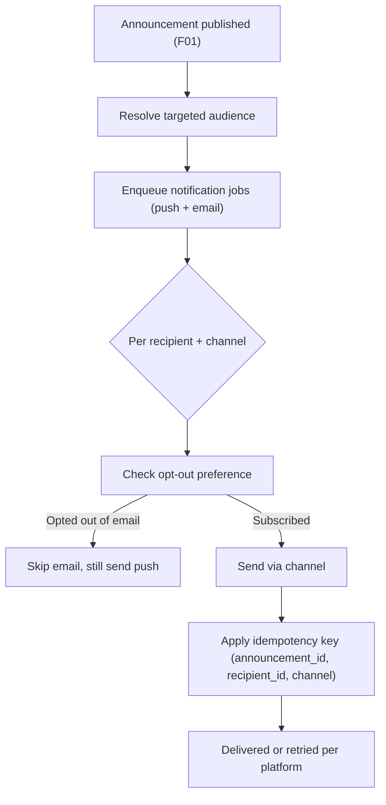

> **Parent:** [EXP-J28 Overview](./overview.md) | **Phase:** MVP

# F04: Notifications

## Summary

This area covers how a published announcement reaches people outside the app: push and email notifications fanned out to the targeted audience on publish, the in-app dashboard signal, opt-out handling via existing notification preferences, and reliable delivery at scale. This is the "reach deskless workers instantly" engine — push is the primary channel, email is the fallback. Available on all plans.

---

## 1. Flows & Acceptance Criteria

### 1.1 Fan-out on publish (primary flow)

**Flow**



**Preconditions**
- An announcement has been successfully persisted and published.
- The targeted audience has been resolved (org-wide or specific group(s)).

**Acceptance Criteria**

```gherkin
Scenario: Happy path — push and email on publish
  Given an announcement is published to the entire organisation
  When the fan-out runs
  Then each targeted active person receives one push notification and one email
    And push delivery for individual recipients occurs within 60 seconds (subject to async queue)

Scenario: Group-targeted fan-out
  Given an announcement targets only the Warehouse group
  When the fan-out runs
  Then only Warehouse group members receive push and email
    And people outside the group receive neither

Scenario: Email opt-out respected
  Given a person has opted out of announcement emails in notification preferences
  When an announcement they are targeted by is published
  Then they do not receive an email
    But they still receive a push notification and see it in the feed and widget

Scenario: No duplicates on retry
  Given the notification system retries a failed delivery
  When the same (announcement_id, recipient_id, channel) is processed again
  Then the recipient receives the notification at most once (idempotency key enforced)

Scenario: In-app signal always present
  Given a person has both push and email disabled
  When an announcement targeted at them is published
  Then it still appears in their feed and dashboard widget, shown as "Not viewed" until opened
```

### 1.2 Fan-out at scale

**Preconditions**
- The targeted audience is large (e.g., 500+ recipients).

**Acceptance Criteria**

```gherkin
Scenario: Large-org async processing
  Given an org with 500+ members publishes an org-wide announcement
  When the fan-out runs
  Then notifications are queued and processed asynchronously
    And there is no guarantee of simultaneous delivery
    And all notifications are delivered within 5 minutes (SLA)

Scenario: Offline device retry
  Given a recipient's device is offline at publish time
  When the device comes back online
  Then push follows standard platform retry behaviour (APNs / FCM)
    And the email serves as a fallback channel
```

---

## 2. Functional Requirements

| ID | Priority | Requirement | Actors (Roles) | AC Reference |
|----|----------|-------------|-----------------|--------------|
| FR-NOTIF-001 | P0 | System sends a push notification to all targeted recipients on publish, delivered within 60 seconds for individual recipients (subject to async queue). | System → All recipients | 1.1 |
| FR-NOTIF-002 | P0 | System sends an email notification to targeted recipients on publish; recipients can opt out of announcement emails in notification preferences. | System → All recipients | 1.1 |
| FR-NOTIF-003 | P0 | System resolves the audience (org-wide or group) and only notifies people within it. | System | 1.1 |
| FR-NOTIF-004 | P0 | Notification system uses idempotency keys so each (announcement_id, recipient_id, channel) is sent at most once. | System | 1.1 |
| FR-NOTIF-005 | P1 | System queues and processes notifications asynchronously for large orgs, with an SLA of all notifications delivered within 5 minutes. | System | 1.2 |
| FR-NOTIF-006 | P1 | In-app dashboard widget signal is always shown for targeted recipients regardless of push/email preferences. | System → All recipients | 1.1 |

Priority: **P0** = Must Have, **P1** = Should Have, **P2** = Nice to Have.

---

## 3. UX & Design

### 3.1 Design artifacts

| Screen/Flow | Design Link |
|-------------|-------------|
| Push notification copy | [Figma TBD]() |
| Email template | [Figma TBD]() |
| Notification preferences — announcement email opt-out (EXP-J02) | [Figma TBD]() |

### 3.2 Platform availability

| Capability | Mobile | Web | Desktop | Kiosk |
|-----------|--------|-----|---------|-------|
| Push notification | ✅ | ✅ (web push, where supported) | ✅ | N/A (shared device) |
| Email notification | ✅ | ✅ | ✅ | ✅ (sent to the person, not the device) |
| In-app widget signal | ✅ | ✅ | ✅ | ✅ |

---

## 4. Edge Cases & Error Handling

### 4.1 Edge cases

| Scenario | Expected Behavior | Status |
|----------|-------------------|--------|
| Push delivery fails (device offline) | Standard APNs/FCM retry; email is the fallback. | Finalized |
| Person has push + email disabled | Still surfaced in feed and widget; "Not viewed" until opened. | Finalized |
| Duplicate push/email on retry | Idempotency key prevents more than one send per (announcement, recipient, channel). | Finalized |
| Large org (500+) | Async queue; delivered within 5-minute SLA; no simultaneity guarantee. | Open — Eng to confirm infra handles fan-out (Overview OQ / risk) |
| Multi-org: Org A publishes | Only Org A recipients notified; data does not cross org boundaries. | Finalized |
| Recipient has no email on file | Skip email; rely on push and in-app. | Finalized |
| Announcement deleted shortly after publish | Best-effort cancel of pending notifications; already-sent notifications may link to a removed item — link resolves to a graceful "no longer available" state. | TBD |

### 4.2 Validation errors

N/A — F04 does not take direct person input; it reacts to the publish event from F01.

### 4.3 System errors

| Error Scenario | Severity | Person-Facing Message | System Behavior |
|----------------|----------|----------------------|-----------------|
| Email provider outage | Medium | (none) | Push + in-app still deliver; email retried per provider policy |
| Push provider (APNs/FCM) outage | Medium | (none) | Email + in-app still deliver; push retried |
| Queue backlog exceeds SLA | High (ops) | (none) | Alert ops; monitor; scale workers |

---

## 5. Notifications

This is the notifications spec. Summary table of every notification this feature emits:

| Trigger | Recipient | Channel(s) | Content Summary | Opt-out? |
|---------|-----------|------------|-----------------|----------|
| New announcement published | All targeted recipients | Push | Announcement title + author name | Yes (via notification preferences) |
| New announcement published | All targeted recipients | Email | Announcement title + link to view in Jibble | Yes (via notification preferences) |
| Unread announcement on dashboard | All targeted recipients | In-app (dashboard widget) | Latest unread announcement title | No (always shown) |

<!-- QUESTION: Should the push payload include a short body preview, or title + author only? Privacy consideration for lock-screen previews on shared/personal devices. -->

---

## 6. Safety Limits

| Limit | Value | Enforcement | Behavior When Exceeded |
|-------|-------|-------------|------------------------|
| Delivery SLA (all recipients) | 5 minutes | Queue worker monitoring | Ops alert; scale workers |
| Per-recipient per-channel sends | 1 per announcement | Idempotency key | Additional attempts deduplicated |
| Notification queue throughput | TBD | Infra | Backpressure / autoscale |

---

## 7. Analytics & Instrumentation

Notification-related events (full event catalogue lives with the broader analytics plan; included here for completeness):

| Event name | Trigger | Key properties |
|------------|---------|----------------|
| `announcement_created` | Author publishes | `user_id`, `org_id`, `announcement_id`, `audience_type`, `group_ids`, `has_mandatory_confirmation`, `has_image`, `plan_tier` |
| `announcement_widget_viewed` | Widget renders with unread content | `user_id`, `org_id`, `unread_count` |
| `announcement_widget_tapped` | Person taps the widget | `user_id`, `org_id` |

> Note: the complete analytics event catalogue (views, confirmations, pins, edits, deletes, feed views, upgrade prompts, read-report views) is maintained in the overview's instrumentation appendix and the relevant area specs.
